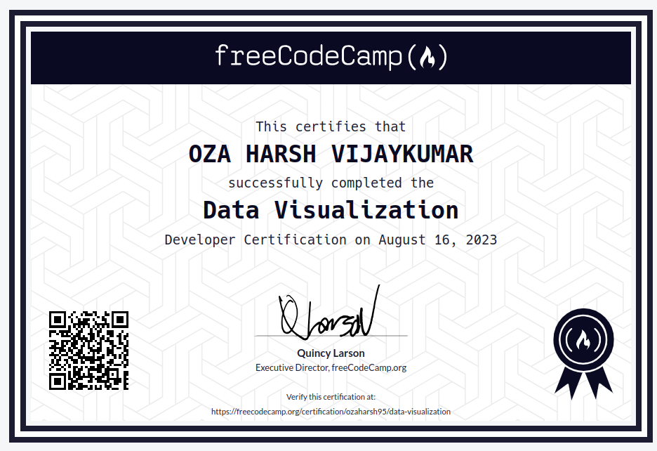

# 📊 Data Visualization 🚀

 🎉 Welcome to my Data Visualization adventure! This repository documents my journey through the Data Visualization Certification course, where I learned how to transform raw data into compelling visual storytelling 🎈.

## 📚 Course Overview

### 📌 Data Visualization with D3
+ D3, or D3.js, stands for Data Driven Documents. It's a JavaScript library for creating dynamic and interactive data visualizations in the browser.
+ D3 is built to work with common web standards – namely HTML, CSS, and Scalable Vector Graphics (SVG).
+ D3 supports many different kinds of input data formats. Then, using its powerful built-in methods, you can transform those data into different charts, graphs, and maps.
### 📌 JSON APIs and AJAX
+ APIs (Application Programming Interfaces) are like UIs for programs, enabling them to interact with each other by sending and receiving data.
+ APIs facilitate communication between computers, serving as tools for data exchange.
+ AJAX (Asynchronous JavaScript and XML) is commonly used by programmers to work with APIs.
+ AJAX involves making asynchronous requests to a server to transfer data, then displaying the received data on the page.
+ JSON (JavaScript Object Notation) is a typical format for data transferred between the browser and server in this context.

### 🎁 Data Visualization Projects

Put your newfound skills to the test with these challenging projects:

- Bar Chart 📊: Sip of Data [Link](https://github.com/ozaharsh95/Freecodecamp_Data_Visualization/tree/main/Project%201:%20%20Visualize%20Data%20with%20a%20Bar%20Chart)
- Scatterplot Graph 📈: Connect the Dots [Link](https://github.com/ozaharsh95/Freecodecamp_Data_Visualization/tree/main/Project%202:%20%20Visuliza%20Data%20with%20a%20Scatterplot%20Graph)
- Heat Map 🌡️: Data Inferno [Link](https://github.com/ozaharsh95/Freecodecamp_Data_Visualization/tree/main/Project%203:%20%20Visulize%20Data%20with%20a%20Heat%20Map)
- Choropleth Map 🗺️: Cartography Magic [Link](https://github.com/ozaharsh95/Freecodecamp_Data_Visualization/tree/main/Project%204:%20%20Visuliza%20Data%20with%20a%20Choropleth%20Map)
- Treemap Diagram 📊: Descend into Hierarchy [Link](https://github.com/ozaharsh95/Freecodecamp_Data_Visualization/tree/main/Project%205:%20%20Visuliza%20Data%20with%20a%20Treemap%20Diagram)
  
## 🌟 What I Learned
+ Add Document Elements with D3 
+ Select a Group of Elements with D3 
+ Work with Data in D3 
+ Work with Dynamic Data in D3 
+ Add Inline Styling to Elements
+ Change Styles Based on Data
+ Add Classes with D3
+ Update the Height of an Element Dynamically 
+ Change the Presentation of a Bar Chart
+ Learn About SVG in D3
+ Display Shapes with SVG 
+ Create a Bar for Each Data Point in the Set 
+ Dynamically Set the Coordinates for Each Bar 
+ Dynamically Change the Height of Each Bar 
+ Invert SVG Elements 
+ Change the Color of an SVG Element 
+ Add Labels to D3 Elements 
+ Style D3 Labels 
+ Add a Hover Effect to a D3 Element 
+ Add a Tooltip to a D3 Element 
+ Create a Scatterplot with SVG Circles
+ Add Attributes to the Circle Elements 
+ Add Labels to Scatter Plot Circles 
+ Create a Linear Scale with D3 
+ Set a Domain and a Range on a Scale
+ Use the d3.max and d3.min Functions to Find 
+ Minimum and Maximum Values in a Dataset 
+ Use Dynamic Scales 
+ Use a Pre-Defined Scale to Place Elements 
+ Add Axes to a Visualization 
+ Handle Click Events with JavaScript using the onclick property 
+ Change Text with click Events 
+ Get JSON with the JavaScript XMLHttpRequest Method 
+ Get JSON with the JavaScript fetch method 
+ Access the JSON Data from an API 
+ Convert JSON Data to HTML 
+ Render Images from Data Sources 
+ Pre filter JSON to Get the Data You Need  
+ Get Geolocation Data to Find A User's GPS Coordinates 
+ Post Data with the JavaScript XMLHttpRequest Method 

## 🎯 Certificate :

## 🌐 Let's Connect

Explore the magic of data visualization with me! Feel free to reach out, collaborate, and embark on new adventures in the realm of data.

[LinkedIn](https://www.linkedin.com/in/ozaharsh955/)

